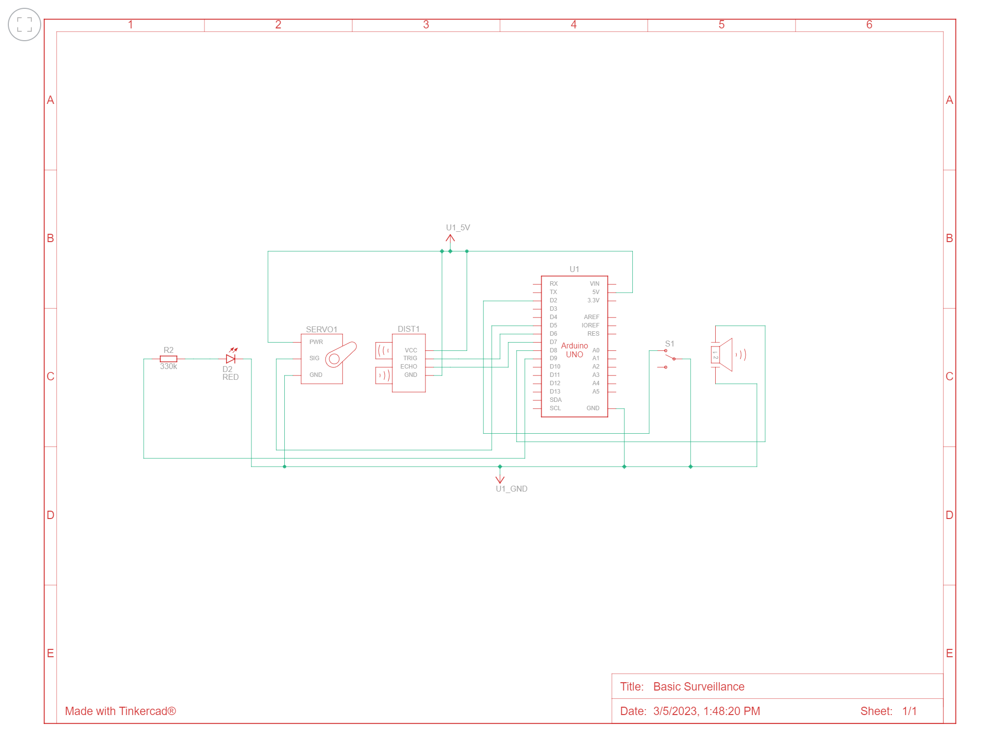

# Security Surveillance Camera
This project is a circuit design of a basic surveillance camera, using the Sparkfun Inventor's Kit. It provides a starting point for a 'DIY' home security system from components that can be affordably acquired. It is intended for engineering students of an undergraduate level, or hobby roboticists or engineers. 

The motivation for this project was to gain introductory learning via an end-to-end project in the fields of robotics, electronics, signals intelligence, security, and IoT. While the first iteration is basic, it provides groundwork that can be built on in the future, for example, the Serial monitor capabilities using the ultrasonic sensor can be extended to incorporate IoT data mining or ML techniques for human recognition. If a USB shield is acquired, the circuit can be connected to a webcam, or mobile phone, to add video capabilities, and likely can be integrated with a mobile application.

I was able to practice systems thinking and active learning while learning Arduino and circuit design during this project. During the implementation, I encountered for the first time the added dimension of complexity in programming for physical movement. It is difficult to fabricate or customize components to produce the type of movement one might expect while programming, or simulating. One will likely encounter unanticipated errors in movement, or limitations in hardware components, and it is a fun task to try to come up with novel solutions to sensors, actuators, or applications of components working together.

This is a good introductory project for an undergraduate student or hobbyist, as it provides both learning value, and real-world value by providing home security, or data collection mechanisms.

## Features and Components
- **Components**: 1x U1 Arduino Uno R3, 1x R2 330kΩ Resistor
- **Actuators**: 1x PIEZO1 Piezo buzzer, 1x SERVO1 Continuous Micro Servo, 1x D2 Red LED, 1x S1 Slideswitch
- **Sensors**: 1x DIST1 Ultrasonic Distance Sensor
- **Serial Monitor**: Provides serial monitor data if connected to the Arduino IDE via the Ultrasonic Distance Sensor.

## Schematic and Circuit Diagrams

## Bill of Materials

## Assembly Instructions
Assemble the circuit according to this diagram:

## Usage and Operation
Mount the camera where desired, and connect to a power source. When connected by USB to the computer, the serial monitor produces this output.

## Troubleshooting and FAQs
Please refer to the Arduino startup guide for the IDE used for this project, and the Sparkfun Inventor's Kit's tutorial on the Redboard Qwiic, especially installing the correct drivers:
- [Arduino](https://www.arduino.cc/en/Guide)
- [Sparkfun Inventor's Kit Redboard Qwiic](https://learn.sparkfun.com/tutorials/redboard-qwiic-hookup-guide)

## License
All rights reserved.
